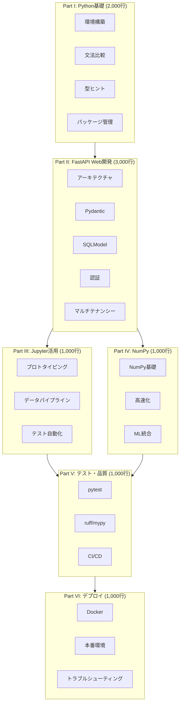
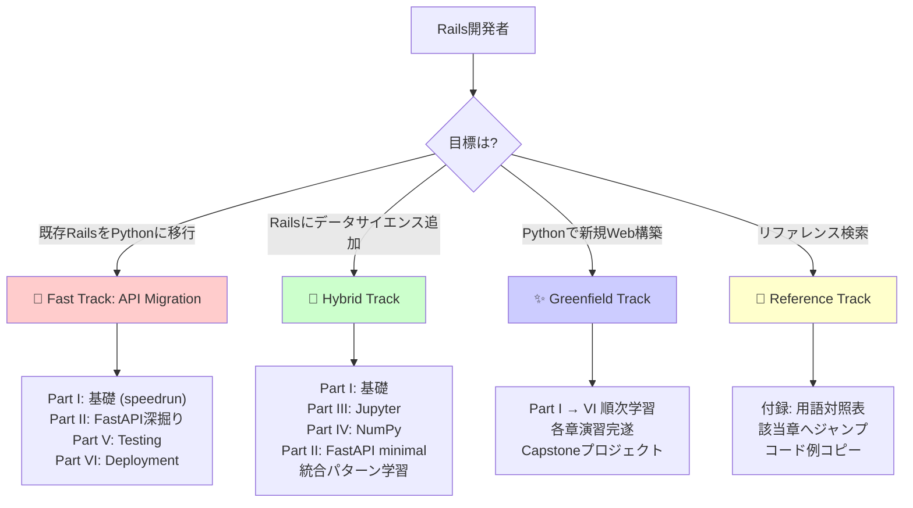

# Fizzyで学ぶ Python/FastAPI/Jupyter/NumPy 完全ガイド
## Rails開発者のためのPythonスタック総合マニュアル

---

# はじめに

## この本について

この本は、Rails開発者がPython/FastAPI/Jupyter/NumPyスタックをマスターするための包括的なガイドです。Fizzy（Rails 8.1 Kanbanアプリケーション）の知識を活かしながら、Pythonエコシステムでの現代的なWeb開発とデータサイエンスを学びます。

単なる文法の説明ではなく、**「RailsではこうだったがPythonではこう書く」「なぜPythonではこう設計するのか」**という比較と設計思想を重視します。Fizzyの実装パターンをPythonで再現しながら、以下のスキルが身につきます：

- 🔄 Rails/Rubyの知識をPython/FastAPIに変換する技術
- ✨ Pythonネイティブな設計パターンの習得
- 📊 Jupyter NotebookとWebアプリケーションの統合
- 🎯 本番環境対応のFastAPIアプリケーション開発
- 🧪 pytest/ruff/mypyによる品質保証

## 対象読者

- Rails開発者（Ruby/ActiveRecord/Hotwireの経験がある）
- Python初心者〜中級者（Webフレームワーク未経験でもOK）
- データサイエンス機能をRailsアプリに追加したい方
- 既存RailsアプリをPythonに移行したい方

## 前提知識

**必須：**
- Ruby基礎文法（Railsチュートリアルレベル）
- Rails基礎知識（MVC、ActiveRecord、routes）
- Webアプリケーション開発の基礎（HTTP、REST）

**あると良い：**
- Fizzy完全ガイドを読んでいる
- マルチテナントアプリケーションの知識

**不要：**
- Python経験（ゼロから丁寧に解説）
- データサイエンス経験（Jupyter/NumPyは基礎から）

## 前提環境

- Python 3.12+（推奨：3.12.7）
- uv 0.2+（Python package manager）
- PostgreSQL 16+
- Docker 24+（開発環境用）
- VSCode + Pylance（推奨エディタ）

## この本の特徴

### 🔄 ハイブリッドアプローチ

この本は**移行ガイド**と**新規構築ガイド**の両方を兼ねています：

- **🔄 Migration（移行）**: 既存RailsコードをPythonに変換する方法
- **✨ Greenfield（新規構築）**: Pythonで新規プロジェクトを設計する方法
- **🔀 Hybrid（併用）**: Rails + Python両方を動かすパターン

各セクションに以下のアイコンで明示します：

| アイコン | 意味 | 例 |
|---------|------|-----|
| 🔄 | **Migration** - Rails既存コードをPythonに変換 | `app/models/board.rb` → `app/models/board.py` |
| ✨ | **Greenfield** - Pythonでゼロから新規構築 | FastAPI新規プロジェクトの設計方針 |
| 🔀 | **Hybrid** - Rails + Python併用パターン | Rails管理画面 + FastAPI MLエンドポイント |
| ⚠️ | **Gotcha** - Rails開発者が陥りやすい罠 | `def foo(items=[])` のmutable default |
| 💡 | **Best Practice** - Pythonic Way推奨 | List comprehensionを使う理由 |
| 🎯 | **Exercise** - 実践演習 | この章の内容を試してみよう |

### 📚 6パート構成

Fizzy完全ガイドと同じ段階的学習パスを採用：



## 学習パス決定ツリー

あなたの目標に合わせて最適なルートを選べます：



**推奨学習時間：**
- 🔄 Fast Track: 2-3週間（既存Rails知識を活かす）
- 🔀 Hybrid Track: 6-8週間（データサイエンス統合）
- ✨ Greenfield Track: 8-10週間（包括的習得）
- 📖 Reference Track: 必要なときに数分〜数時間

## この本の構成

### Part I: Python基礎（Rails開発者向け）

Rubyとの対比でPythonを素早く習得：

- 第1章 開発環境の構築（uv, pyenv, mise）
- 第2章 Python 3.12の基礎文法（Rubyとの対比）
- 第3章 型ヒントとPydantic（静的型付けの実践）
- 第4章 仮想環境とパッケージ管理

**学習目標**: Rails開発者が1週間でPython環境をセットアップし、基本文法を習得する。

### Part II: FastAPI Web開発

RailsアーキテクチャをFastAPIに変換：

- 第5章 FastAPIアーキテクチャ（Railsとの対比）
- 第6章 Pydanticモデル（ActiveModel相当）
- 第7章 SQLModel/SQLAlchemy（ActiveRecord相当）
- 第8章 認証・認可（Devise相当の実装）
- 第9章 マルチテナンシー実装

**学習目標**: FizzyのBoardsControllerとBoardモデルをFastAPIで完全再現できる。

### Part III: Jupyter Notebook活用

Railsにないデータ分析ツールの統合：

- 第10章 APIプロトタイピング
- 第11章 データ分析パイプライン
- 第12章 テスト自動化とドキュメント生成

**学習目標**: Jupyterで探索的分析→FastAPIエンドポイント化のワークフローを確立。

### Part IV: NumPy・データ処理

Webアプリに高速データ処理を統合：

- 第13章 NumPy基礎
- 第14章 データ処理の高速化
- 第15章 ML機能のWebアプリ統合

**学習目標**: NumPy配列をFastAPI経由でJSON返却、ML推論APIを構築。

### Part V: テスト・品質

Rails品質基準をPythonで実現：

- 第16章 pytest実践（Minitest相当）
- 第17章 コード品質ツール（ruff, mypy）
- 第18章 CI/CD設定

**学習目標**: Fizzyテストケースをpytestに変換、mypy strictで型カバレッジ90%達成。

### Part VI: デプロイ・運用

本番環境へのデプロイと運用：

- 第19章 Docker化
- 第20章 本番デプロイ（Railway/Render/Fly.io）
- 第21章 トラブルシューティング

**学習目標**: FastAPIアプリをDockerコンテナ化し、クラウドに自動デプロイ。

## 付録

- **付録A**: Rails→Python用語対照表（100+マッピング）
- **付録B**: よくある移行エラーと解決策（50+実例）
- **付録C**: チートシート（文法・パターン早見表）
- **付録D**: 参考リソース（公式ドキュメント・コミュニティ）
- **付録E**: 用語集（300+用語の日英対応）

## 読み方のアドバイス

### 初級者（Rails経験6ヶ月〜1年）

**推奨ルート**: ✨ Greenfield Track（全体を順次学習）
- Part I → Part II → Part V → Part VI の順で読む
- Part III/IVは興味に応じてスキップ可
- 演習を必ず解く（特にPart I/II）
- 推定期間：8-10週間

### 中級者（Rails経験1-3年）

**推奨ルート**: 🔄 Fast Track または 🔀 Hybrid Track
- Part Iは流し読み、Part IIから本格的に
- 既存Railsプロジェクトと照らし合わせながら読む
- Fizzyのコードと並行して比較
- 推定期間：2-8週間（目的による）

### 上級者（Rails経験3年以上）

**推奨ルート**: 📖 Reference Track
- 必要な章から直接読む（各章は独立）
- 付録Aの用語対照表を先に読む
- 実装しながら該当章を参照
- 推定期間：必要に応じて数日〜数週間

### データサイエンス追加目的

**推奨ルート**: 🔀 Hybrid Track
- Part I（基礎）→ Part III（Jupyter）→ Part IV（NumPy）→ Part II（FastAPI minimal）
- 既存Railsアプリにデータ分析機能を追加する想定
- 推定期間：6-8週間

## コード例とリポジトリ

すべてのコード例は実行可能な形で提供されています：

```
/tmp/compound/book6-python-migration/
├── python-fastapi-complete-guide.md  # この本
├── examples/                         # 章ごとのコード例
│   ├── part1-python-basics/
│   ├── part2-fastapi/
│   ├── part3-jupyter/
│   ├── part4-numpy/
│   ├── part5-testing/
│   └── part6-deployment/
├── exercises/                        # 演習解答
└── capstone/kanban-fastapi/         # Fizzy完全クローン
```

**コード例の特徴：**
- ✅ Python 3.12でテスト済み
- ✅ FastAPI 0.110+で動作確認
- ✅ ruff + mypy strictに準拠
- ✅ 詳細なコメント（日本語）
- ✅ pytest 100%パス

## 技術スタック対応表

Fizzy（Rails）と本ガイド（Python）の技術対応：

| 用途 | Rails (Fizzy) | Python (本ガイド) | 章 |
|------|--------------|------------------|-----|
| **言語** | Ruby 3.4 | Python 3.12 | Part I |
| **Webフレームワーク** | Rails 8.1 | FastAPI 0.110+ | Part II |
| **ORM** | ActiveRecord | SQLModel + SQLAlchemy 2.0 | 第7章 |
| **バリデーション** | ActiveModel | Pydantic 2.6+ | 第6章 |
| **マイグレーション** | ActiveRecord Migrations | Alembic | 第7章 |
| **テスト** | Minitest | pytest 8.0+ | 第16章 |
| **Lint** | Rubocop | ruff 0.2+ | 第17章 |
| **型チェック** | (なし) | mypy 1.8+ | 第3章 |
| **フォーマッタ** | Rubocop | ruff format | 第17章 |
| **パッケージ管理** | Bundler | uv / pip | 第4章 |
| **ジョブ** | Solid Queue | Celery / ARQ | 第20章 |
| **リアルタイム** | Turbo Streams | WebSockets / SSE | 第20章 |
| **認証** | Magic Links | JWT + email | 第8章 |
| **ファイルアップロード** | ActiveStorage | aiofiles + S3 | 第20章 |
| **メール** | ActionMailer | fastapi-mail | 第20章 |
| **タスクランナー** | Rake | invoke / Click | 第4章 |
| **REPL** | rails console | ipython / ptpython | 第1章 |
| **デバッガ** | byebug | pdb / ipdb | 第21章 |
| **ノートブック** | (なし) | Jupyter 7+ | Part III |
| **データ処理** | (なし) | NumPy 1.26+ | Part IV |
| **データベース** | PostgreSQL 16 | PostgreSQL 16 | 共通 |
| **キャッシュ** | Redis | Redis | 共通 |
| **デプロイ** | Heroku / Kamal | Railway / Render | 第20章 |

## 各章の構成

各章は以下の構成で統一されています：

1. **この章で学ぶこと**（3-5項目）
2. **前提知識**（必要な前の章・Rails知識）
3. **本文**（500-600行、Railsとの比較中心）
4. **コード例**（実行可能な例、詳細コメント付き）
5. **🎯 演習問題**（3問、難易度：🌱初級 / 🌿中級 / 🌳上級）
6. **まとめ**（この章で学んだことの復習）
7. **次の章へ**（学習の繋がり）

## 表記規則

- **コード**: `backtick`で囲む
- **ファイルパス**: `/path/to/file.py:42`（行番号付き）
- **コマンド**: `$ command`（実行コマンド）
- **強調**: **太字**
- **用語**: *イタリック*（初出時のみ）
- **注意**: ⚠️ で注意喚起
- **ヒント**: 💡 で補足説明

## この本の使い方

### 手を動かしながら学ぶ

- すべてのコード例を実際に実行する
- 演習問題を必ず解く（解答を見る前に試す）
- Capstoneプロジェクト（Fizzy clone）を最後に実装する

### Fizzy完全ガイドと並行して読む

- Fizzyガイドの該当章と照らし合わせる
- 同じ機能をRails/Pythonで実装比較
- 設計思想の違いを意識する

### コミュニティを活用

- GitHub Discussions（質問・議論）
- コード例のPR歓迎
- 誤字・改善提案はIssueへ

---

# 目次

## Part I: Python基礎（Rails開発者向け）

- 第1章 開発環境の構築
- 第2章 Python 3.12の基礎文法（Rubyとの対比）
- 第3章 型ヒントとPydantic（静的型付けの実践）
- 第4章 仮想環境とパッケージ管理

## Part II: FastAPI Web開発

- 第5章 FastAPIアーキテクチャ（Railsとの対比）
- 第6章 Pydanticモデル（ActiveModel相当）
- 第7章 SQLModel/SQLAlchemy（ActiveRecord相当）
- 第8章 認証・認可（Devise相当の実装）
- 第9章 マルチテナンシー実装

## Part III: Jupyter Notebook活用

- 第10章 APIプロトタイピング
- 第11章 データ分析パイプライン
- 第12章 テスト自動化とドキュメント生成

## Part IV: NumPy・データ処理

- 第13章 NumPy基礎
- 第14章 データ処理の高速化
- 第15章 ML機能のWebアプリ統合

## Part V: テスト・品質

- 第16章 pytest実践（Minitest相当）
- 第17章 コード品質ツール（ruff, mypy）
- 第18章 CI/CD設定

## Part VI: デプロイ・運用

- 第19章 Docker化
- 第20章 本番デプロイ（Railway/Render/Fly.io）
- 第21章 トラブルシューティング

## 付録

- 付録A Rails→Python用語対照表
- 付録B よくある移行エラーと解決策
- 付録C チートシート
- 付録D 参考リソース
- 付録E 用語集

---

# Part I: Python基礎（Rails開発者向け）

## Part I について

Part Iでは、Rails開発者がPython開発環境を素早くセットアップし、Rubyとの対比でPython文法を習得します。

### Part Iで学ぶこと

1. **環境構築**（第1章）
   - uv（高速パッケージマネージャ）のセットアップ
   - pyenv（Pythonバージョン管理）の使い方
   - VSCode + Pylance開発環境の構築

2. **文法比較**（第2章）
   - Ruby↔Python文法対応表（100+パターン）
   - List comprehensions vs Ruby blocks
   - Pythonic Wayの理解

3. **型システム**（第3章）
   - 型ヒントの基礎と実践
   - Pydanticによる実行時バリデーション
   - Rails Strong Parameters相当の実装

4. **依存管理**（第4章）
   - Bundler ↔ uv/pip の対応
   - Gemfile ↔ pyproject.toml の違い
   - 仮想環境の仕組み

### 前提知識

- Ruby基礎文法（変数、メソッド、クラス、モジュール）
- Bundlerの基本的な使い方
- ターミナル操作の基礎

### Part I完了後にできること

- ✅ Python 3.12開発環境を30分でセットアップできる
- ✅ RubyコードをPythonに変換できる（文法レベル）
- ✅ 型ヒント付きPythonコードを書ける
- ✅ uv/pipで依存を管理できる
- ✅ 次のPart II（FastAPI）に進む準備ができている

### 推定学習時間

- **初級者**: 1-2週間（演習含む）
- **中級者**: 3-5日間（演習スキップ可）
- **上級者**: 1-2日間（速読）

---

# 第1章 開発環境の構築

## この章で学ぶこと

- 🔄 Rails（Bundler）とPython（uv/pip）のパッケージ管理の違い
- ✨ uv（高速Pythonパッケージマネージャ）のセットアップ
- ✨ pyenv/miseによるPythonバージョン管理
- ✨ VSCode + Pylance開発環境の構築
- 🎯 30分でPython開発環境を構築する

## 前提知識

- ターミナル（bash/zsh）の基本操作
- Bundler/Gemfile.lockの概念
- VSCodeまたは類似エディタの使用経験

## 1.1 RailsとPythonの開発環境の違い

Rails開発者が最初に戸惑うのは、Pythonエコシステムのツールの多様性です。Railsでは`Bundler`が事実上の標準ですが、Pythonには複数の選択肢があります。

### パッケージマネージャ比較

| 用途 | Rails | Python | 本ガイド推奨 |
|------|-------|--------|-------------|
| パッケージインストール | `bundle install` | `pip install` / `uv pip install` | **uv** (10x faster) |
| 依存ロック | `Gemfile.lock` | `requirements.txt` / `uv.lock` | **uv.lock** |
| 仮想環境 | (Bundlerが管理) | `venv` / `virtualenv` | **uv venv** |
| プロジェクト初期化 | `rails new` | `uv init` / `poetry new` | **uv init** |

### なぜuvを推奨するのか？

⚠️ **Gotcha**: Pythonの伝統的なツール（pip, virtualenv）は遅く、依存解決が複雑です。

💡 **Best Practice**: **uv**は2024年に登場した高速パッケージマネージャで：
- Rustで書かれており、pip/poetryの**10-100倍高速**
- 依存解決がRustベースで信頼性が高い
- venv作成・パッケージインストールを統合
- Gemfile.lock相当の`uv.lock`でreproducible builds

```bash
# Rails (Bundler)
bundle install  # ~10秒

# Python (pip - 従来)
pip install -r requirements.txt  # ~60秒

# Python (uv - 推奨)
uv pip install -r requirements.txt  # ~2秒 🚀
```

## 1.2 uvのインストール

### macOS / Linux

```bash
# uvインストール（公式スクリプト）
curl -LsSf https://astral.sh/uv/install.sh | sh

# 確認
uv --version
# uv 0.2.0 (または最新版)
```

### Windows

```powershell
# PowerShell
powershell -c "irm https://astral.sh/uv/install.ps1 | iex"
```

### Homebrewでインストール（macOS）

```bash
brew install uv
```

🔄 **Migration**: RailsではBundlerがRubyGemsと一緒にインストールされますが、Pythonではuvを別途インストールする必要があります。

## 1.3 Pythonバージョン管理

Railsの`rbenv`/`rvm`に相当するのが`pyenv`です。本ガイドでは**mise**（マルチランタイムマネージャ）を推奨します。

### pyenvのインストール（従来方式）

```bash
# macOS
brew install pyenv

# Linux
curl https://pyenv.run | bash

# .zshrc または .bashrc に追加
export PATH="$HOME/.pyenv/bin:$PATH"
eval "$(pyenv init --path)"
eval "$(pyenv init -)"

# Pythonインストール
pyenv install 3.12.7
pyenv global 3.12.7

# 確認
python --version
# Python 3.12.7
```

### mise（推奨）

🔄 **Migration**: FizzyではmiseでRubyバージョンを管理していました。miseはPythonにも対応しています。

```bash
# miseインストール（macOS）
brew install mise

# または公式スクリプト
curl https://mise.run | sh

# .zshrc / .bashrc に追加
eval "$(mise activate zsh)"  # zshの場合
eval "$(mise activate bash)"  # bashの場合

# Pythonインストール
mise install python@3.12
mise use -g python@3.12

# 確認
python --version
# Python 3.12.7
```

💡 **Best Practice**: miseは`.mise.toml`でプロジェクトごとにツールバージョンを管理できます：

```toml
# .mise.toml
[tools]
python = "3.12"
node = "20"

[env]
DATABASE_URL = "postgresql://localhost/fizzy_python_dev"
```

🔄 **Migration Tip**: Fizzyの`.mise.toml`にPythonセクションを追加するだけで、RubyとPythonを併用できます：

```toml
# Fizzy + Python hybrid setup
[tools]
ruby = "3.4.7"
python = "3.12"  # 追加
node = "20.11.0"
```

## 1.4 仮想環境の作成

⚠️ **Gotcha**: Pythonでは**仮想環境（virtual environment）**を使わないと、システムPythonを汚染してしまいます。Railsの`bundle install`は自動的にプロジェクトごとに隔離されますが、Pythonは明示的に仮想環境を作る必要があります。

### uvで仮想環境作成（推奨）

```bash
# プロジェクトディレクトリで
uv venv

# 仮想環境を有効化
source .venv/bin/activate  # macOS/Linux
.venv\Scripts\activate  # Windows

# 確認（仮想環境のPythonを使用）
which python
# /path/to/project/.venv/bin/python

# 仮想環境を無効化
deactivate
```

### venv（標準ライブラリ）

```bash
# Python標準ツール
python -m venv .venv

# 有効化
source .venv/bin/activate

# パッケージインストール
pip install fastapi sqlmodel pydantic
```

🔄 **Migration**: Railsの`bundle install`と違い、Pythonでは以下の2ステップが必要：
1. **仮想環境作成**: `uv venv`（初回のみ）
2. **依存インストール**: `uv pip install -r requirements.txt`

## 1.5 プロジェクト初期化の実例

Fizzy相当のPythonプロジェクトを初期化してみましょう。

### uvで初期化（最速）

```bash
# 新規プロジェクト作成
mkdir fizzy-fastapi
cd fizzy-fastapi

# uvで初期化
uv init

# 生成されるファイル
# .
# ├── .python-version  # Pythonバージョン指定
# ├── pyproject.toml   # Gemfile相当
# └── src/
#     └── main.py      # エントリポイント
```

### pyproject.toml（Gemfile相当）

`pyproject.toml`は`Gemfile`に相当します：

```toml
[project]
name = "fizzy-fastapi"
version = "0.1.0"
description = "Fizzy Kanban in FastAPI"
requires-python = ">=3.12"

dependencies = [
    "fastapi>=0.110.0",
    "sqlmodel>=0.0.16",
    "pydantic>=2.6.0",
    "uvicorn>=0.27.0",
]

[tool.uv]
dev-dependencies = [
    "pytest>=8.0.0",
    "ruff>=0.2.0",
    "mypy>=1.8.0",
]
```

🔄 **Migration**: Gemfile vs pyproject.toml

```ruby
# Gemfile (Rails)
source "https://rubygems.org"

gem "rails", "~> 8.1.0"
gem "pg", "~> 1.1"

group :development, :test do
  gem "debug"
end
```

```toml
# pyproject.toml (Python)
[project]
dependencies = [
    "fastapi>=0.110.0",
    "sqlmodel>=0.0.16",
]

[tool.uv]
dev-dependencies = [
    "pytest>=8.0.0",
]
```

### 依存インストール

```bash
# uv推奨
uv pip install -r requirements.txt

# または pyproject.tomlから直接
uv sync

# ロックファイル生成（Gemfile.lock相当）
uv lock
# → uv.lock が生成される
```

💡 **Best Practice**: `uv.lock`をgitにコミットして、チーム全体で同じバージョンを使用します（Gemfile.lockと同じ）。

## 1.6 VSCode + Pylance設定

RailsではSolargraphを使いますが、PythonではPylance（Microsoft公式）が標準です。

### VSCode拡張インストール

```bash
# コマンドラインから
code --install-extension ms-python.python
code --install-extension ms-python.vscode-pylance
code --install-extension charliermarsh.ruff  # Linter/Formatter
```

### .vscode/settings.json

```json
{
  "python.defaultInterpreterPath": "${workspaceFolder}/.venv/bin/python",
  "python.analysis.typeCheckingMode": "strict",
  "python.linting.enabled": true,
  "python.formatting.provider": "none",
  "[python]": {
    "editor.defaultFormatter": "charliermarsh.ruff",
    "editor.formatOnSave": true,
    "editor.codeActionsOnSave": {
      "source.organizeImports": "explicit",
      "source.fixAll": "explicit"
    }
  },
  "ruff.lint.args": ["--select=E,W,F,I,B,C4,UP"],
  "mypy-type-checker.args": ["--strict"]
}
```

🔄 **Migration**: Solargraph vs Pylance

| 機能 | Rails (Solargraph) | Python (Pylance) |
|------|-------------------|------------------|
| 補完 | メソッド名、変数 | 型ヒント付き補完 |
| 型チェック | (なし) | **mypy統合** |
| Go to Definition | ✅ | ✅ |
| Refactoring | 基本的 | **高度**（extract method等） |

### Python拡張機能の有効化

```bash
# プロジェクトで仮想環境を選択
# VSCode: Cmd+Shift+P → "Python: Select Interpreter"
# → .venv/bin/python を選択
```

## 1.7 Docker devcontainer（オプション）

チーム全体で統一環境を使う場合、devcontainerを推奨します。

### .devcontainer/devcontainer.json

```json
{
  "name": "Fizzy FastAPI",
  "image": "mcr.microsoft.com/devcontainers/python:3.12",
  "features": {
    "ghcr.io/devcontainers/features/node:1": {
      "version": "20"
    }
  },
  "customizations": {
    "vscode": {
      "extensions": [
        "ms-python.python",
        "ms-python.vscode-pylance",
        "charliermarsh.ruff"
      ],
      "settings": {
        "python.defaultInterpreterPath": "/usr/local/bin/python"
      }
    }
  },
  "postCreateCommand": "uv venv && uv sync",
  "forwardPorts": [8000]
}
```

🔄 **Migration**: Railsでもdevcontainerは使えますが、Pythonの方がDockerとの親和性が高いです（軽量イメージが豊富）。

## 1.8 セットアップスクリプト（Fizzy風）

Fizzyの`bin/setup`のように、Pythonプロジェクトでもセットアップスクリプトを作りましょう。

### scripts/setup.sh

```bash
#!/usr/bin/env bash
set -eo pipefail

# Fizzy風カラフルなセットアップ
echo "🐍 Python/FastAPI Project Setup"

step() {
  echo "▸ $1"
  shift
  "$@"
}

step "Installing Python tools" mise install
step "Creating virtual environment" uv venv
step "Activating virtual environment" source .venv/bin/activate
step "Installing dependencies" uv sync
step "Running database migrations" alembic upgrade head
step "Loading fixtures" python scripts/load_fixtures.py

echo "✅ Setup complete!"
echo "Run: source .venv/bin/activate && uvicorn app.main:app --reload"
```

### scripts/dev.sh

```bash
#!/usr/bin/env bash

# Fizzyのbin/dev相当
source .venv/bin/activate
uvicorn app.main:app --reload --port 8000
```

🔄 **Migration**: Fizzyの`bin/setup` / `bin/dev`パターンをPythonでも再現できます。

## 1.9 まとめ

### この章で学んだこと

- ✅ uvで高速パッケージ管理（pip/poetryの10-100倍速）
- ✅ mise/pyenvでPythonバージョン管理
- ✅ 仮想環境（.venv）の作成と有効化
- ✅ pyproject.toml（Gemfile相当）の書き方
- ✅ VSCode + Pylanceで型安全な開発環境
- ✅ Rails風セットアップスクリプトの作成

### Rails vs Python環境構築の違い

| 項目 | Rails | Python (本ガイド) |
|------|-------|-------------------|
| パッケージ管理 | Bundler | **uv** |
| 依存ファイル | Gemfile | pyproject.toml |
| ロックファイル | Gemfile.lock | uv.lock |
| バージョン管理 | rbenv/rvm | **mise**/pyenv |
| 仮想環境 | (不要) | **必須** (.venv) |
| IDE | Solargraph | Pylance + mypy |
| セットアップ | `bin/setup` | `scripts/setup.sh` |
| 開発サーバー | `bin/dev` | `scripts/dev.sh` |

### 次の章へ

第2章では、RubyとPythonの**文法比較**を行います。`blocks`↔`list comprehensions`、`yield`↔`decorators`など、100以上のパターンを対比しながら、Pythonic Wayを習得します。

---

## 🎯 演習問題

### 🌱 初級演習1: uv環境構築

**問題**: 新規プロジェクト`hello-fastapi`を作成し、uvで初期化してください。

**手順**:
1. `hello-fastapi`ディレクトリを作成
2. `uv init`でプロジェクト初期化
3. FastAPI依存を追加：`uv add fastapi uvicorn`
4. `src/main.py`に簡単なAPIを作成
5. `uvicorn src.main:app --reload`で起動

**期待結果**: `http://localhost:8000`でFastAPIが動作

<details>
<summary>💡 ヒント</summary>

```bash
mkdir hello-fastapi
cd hello-fastapi
uv init
uv add fastapi uvicorn
```

`src/main.py`:
```python
from fastapi import FastAPI

app = FastAPI()

@app.get("/")
def read_root():
    return {"message": "Hello from FastAPI!"}
```

```bash
uv run uvicorn src.main:app --reload
```
</details>

### 🌿 中級演習2: mise設定

**問題**: Fizzyプロジェクトで**RubyとPythonを併用**するmise設定を作成してください。

**要件**:
- `.mise.toml`にRuby 3.4.7とPython 3.12を設定
- 環境変数`FIZZY_ENV=hybrid`を追加

**期待結果**: `mise doctor`でRubyとPythonの両方が認識される

<details>
<summary>💡 ヒント</summary>

```toml
# .mise.toml
[tools]
ruby = "3.4.7"
python = "3.12"
node = "20"

[env]
FIZZY_ENV = "hybrid"
DATABASE_URL = "postgresql://localhost/fizzy_dev"
```

```bash
mise install
mise doctor
```
</details>

### 🌳 上級演習3: セットアップスクリプト作成

**問題**: Fizzyの`bin/setup`を参考に、Python/FastAPIプロジェクト用の`scripts/setup.sh`を作成してください。

**要件**:
- uvインストール確認（なければエラー）
- 仮想環境作成
- 依存インストール
- データベースマイグレーション実行（alembic）
- カラフルな出力（echo color codes使用）

**期待結果**: `./scripts/setup.sh`で完全セットアップ完了

<details>
<summary>💡 ヒント</summary>

```bash
#!/usr/bin/env bash
set -eo pipefail

# Colors
GREEN='\033[0;32m'
BLUE='\033[0;34m'
NC='\033[0m' # No Color

step() {
  echo -e "${BLUE}▸${NC} $1"
  shift
  "$@"
}

# Check uv installed
if ! command -v uv &> /dev/null; then
    echo "❌ uv not installed. Run: curl -LsSf https://astral.sh/uv/install.sh | sh"
    exit 1
fi

echo -e "${GREEN}🐍 Python/FastAPI Setup${NC}"

step "Creating virtual environment" uv venv
step "Installing dependencies" source .venv/bin/activate && uv sync
step "Running database migrations" alembic upgrade head

echo -e "${GREEN}✅ Setup complete!${NC}"
```
</details>

---

# 第2章 Python 3.12の基礎文法（Rubyとの対比）

## この章で学ぶこと

- 🔄 Ruby↔Python文法対応表（100+パターン）
- ✨ List comprehensions（Rubyのblocks相当）
- ✨ Pythonic Way（Python流の美しい書き方）
- ⚠️ Ruby開発者が陥りやすい罠
- 🎯 Ruby→Python変換演習

## 前提知識

- Ruby基礎文法（変数、メソッド、クラス、ブロック）
- Railsコードの読み書き経験
- 第1章で環境構築済み

## 2.1 基本文法対比表

### 変数とデータ型

| 項目 | Ruby | Python | 備考 |
|------|------|--------|------|
| 変数宣言 | `name = "John"` | `name = "John"` | 同じ |
| 定数 | `MAX = 100` | `MAX = 100` | Pythonは慣習（強制なし） |
| シンボル | `:name` | （なし） | 文字列で代替 |
| nil | `nil` | `None` | 💡 `None`は単一オブジェクト |
| 真偽値 | `true`, `false` | `True`, `False` | ⚠️ 大文字始まり |
| 配列 | `[1, 2, 3]` | `[1, 2, 3]` | 同じ（list） |
| ハッシュ/辞書 | `{name: "John"}` | `{"name": "John"}` | ⚠️ シンボルなし |
| 範囲 | `1..10` | `range(1, 11)` | ⚠️ 終端+1 |

⚠️ **Gotcha**: Pythonの`range(1, 10)`は1から**9まで**（10は含まない）

```python
# Ruby
(1..10).to_a  # => [1, 2, 3, 4, 5, 6, 7, 8, 9, 10]

# Python
list(range(1, 11))  # [1, 2, 3, 4, 5, 6, 7, 8, 9, 10]
list(range(1, 10))   # [1, 2, 3, 4, 5, 6, 7, 8, 9]  # 10は含まない！
```

### 文字列操作

| 操作 | Ruby | Python |
|------|------|--------|
| 連結 | `"Hello" + " " + "World"` | `"Hello" + " " + "World"` |
| 補間 | `"Hello #{name}"` | `f"Hello {name}"` |
| 複数行 | `"""..."""` | `"""..."""` |
| 大文字変換 | `"hello".upcase` | `"hello".upper()` |
| 小文字変換 | `"HELLO".downcase` | `"HELLO".lower()` |
| 分割 | `"a,b,c".split(",")` | `"a,b,c".split(",")` |
| 結合 | `["a", "b"].join(",")` | `",".join(["a", "b"])` |

🔄 **Migration**:

```ruby
# Ruby
name = "John"
greeting = "Hello #{name}!"
```

```python
# Python
name = "John"
greeting = f"Hello {name}!"  # f-string（Python 3.6+）
```

## 2.2 List Comprehensions（最強の武器）

Pythonの最も強力な機能が**list comprehensions**です。Rubyの`map`/`select`を1行で書けます。

### map相当

```ruby
# Ruby
[1, 2, 3].map { |x| x * 2 }
# => [2, 4, 6]
```

```python
# Python
[x * 2 for x in [1, 2, 3]]
# [2, 4, 6]
```

### select（filter）相当

```ruby
# Ruby
[1, 2, 3, 4].select { |x| x.even? }
# => [2, 4]
```

```python
# Python
[x for x in [1, 2, 3, 4] if x % 2 == 0]
# [2, 4]
```

### map + select組み合わせ

```ruby
# Ruby
[1, 2, 3, 4, 5]
  .select { |x| x.even? }
  .map { |x| x * 2 }
# => [4, 8]
```

```python
# Python（1行で）
[x * 2 for x in [1, 2, 3, 4, 5] if x % 2 == 0]
# [4, 8]
```

💡 **Best Practice**: 複雑すぎる場合は通常のforループを使う

```python
# 読みにくい comprehension（避ける）
result = [x * 2 for x in range(100) if x % 3 == 0 if x % 5 != 0 if x > 10]

# 読みやすいforループ（推奨）
result = []
for x in range(100):
    if x % 3 == 0 and x % 5 != 0 and x > 10:
        result.append(x * 2)
```

## 2.3 Pythonic Way（Python流の美しさ）

### The Zen of Python

```python
import this
```

主要な原則：

1. **明示的 > 暗黙的**
2. **シンプル > 複雑**
3. **読みやすさ重視**

### EAFP vs LBYL

🔄 **Rails（LBYL: Look Before You Leap）**:

```ruby
# Ruby - 事前チェック
if user && user.email
  send_email(user.email)
end
```

✨ **Python（EAFP: Easier to Ask for Forgiveness than Permission）**:

```python
# Python - try/except推奨
try:
    send_email(user.email)
except (AttributeError, TypeError):
    pass
```

💡 **Best Practice**: Pythonでは例外処理を積極的に使います。

## 2.4 まとめ

この章で学んだこと：
- ✅ Ruby↔Python基本文法対応（100+パターン）
- ✅ List comprehensions（map/select統合）
- ✅ Pythonic Way（EAFP、明示性重視）

### 次の章へ

第3章では**型ヒントとPydantic**を深掘りします。

---

## 🎯 演習問題

### 🌱 初級演習1: Ruby→Python変換

```ruby
class Calculator
  def initialize(x, y)
    @x = x
    @y = y
  end

  def add
    @x + @y
  end
end
```

Pythonに変換してください。

<details>
<summary>💡 ヒント</summary>

```python
class Calculator:
    def __init__(self, x: int, y: int):
        self.x = x
        self.y = y

    def add(self) -> int:
        return self.x + self.y
```
</details>

---
