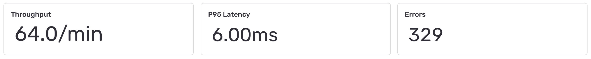
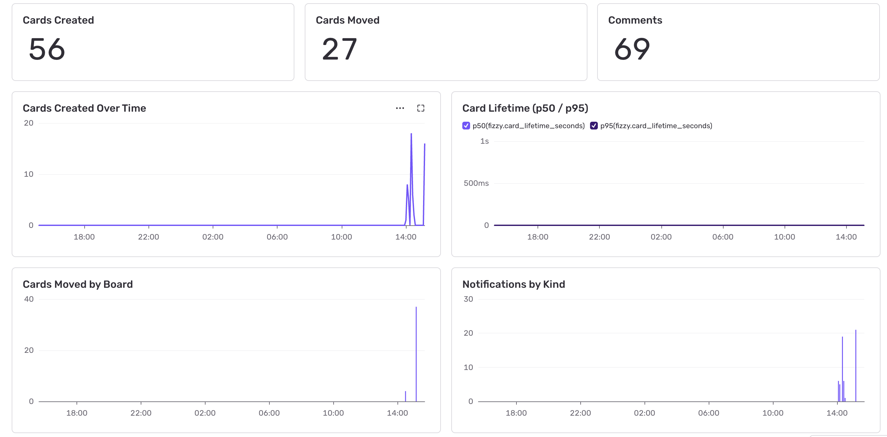
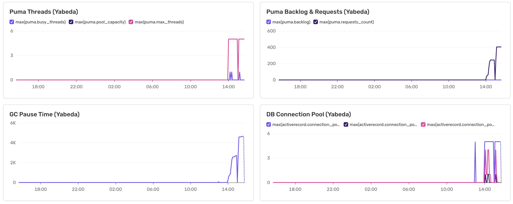

# Sentry Dashboard: Fizzy Observability

A single dashboard covering request performance, business activity, and infrastructure health. All widgets are created via the `sentry` CLI.

## Prerequisites

- Authenticated CLI: `sentry auth login`
- Fizzy running with `SENTRY_DSN` configured
- Traffic data: `bin/rails traffic:generate`

## Create the dashboard

```bash
sentry dashboard create <org>/<project> 'Fizzy Observability'
```

## Request Performance



### Throughput

```bash
sentry dashboard widget add 'Fizzy Observability' 'Throughput' \
  --display big_number --query epm
```

### P95 Latency

```bash
sentry dashboard widget add 'Fizzy Observability' 'P95 Latency' \
  --display big_number --query 'p95:span.duration'
```

### Errors

```bash
sentry dashboard widget add 'Fizzy Observability' 'Errors' \
  --display big_number --dataset error-events --query 'count()'
```

### Latency Over Time

```bash
sentry dashboard widget add 'Fizzy Observability' 'Latency Over Time' \
  --display line \
  --query 'p50:span.duration' \
  --query 'p95:span.duration'
```

### Top Endpoints

```bash
sentry dashboard widget add 'Fizzy Observability' 'Top Endpoints' \
  --display table \
  --query count --query 'p95:span.duration' \
  --group-by transaction --sort count --limit 10
```

## Business Activity



### Cards Created

```bash
sentry dashboard widget add 'Fizzy Observability' 'Cards Created' \
  --display big_number --dataset tracemetrics \
  --query 'sum(value,fizzy.cards_created,counter,none)'
```

### Cards Moved

```bash
sentry dashboard widget add 'Fizzy Observability' 'Cards Moved' \
  --display big_number --dataset tracemetrics \
  --query 'sum(value,fizzy.cards_moved,counter,none)'
```

### Comments

```bash
sentry dashboard widget add 'Fizzy Observability' 'Comments' \
  --display big_number --dataset tracemetrics \
  --query 'sum(value,fizzy.comments_created,counter,none)'
```

### Cards Created Over Time

Line chart of card creation rate, grouped by board.

```bash
sentry dashboard widget add 'Fizzy Observability' 'Cards Created Over Time' \
  --display line --dataset tracemetrics \
  --query 'sum(value,fizzy.cards_created,counter,none)' \
  --group-by board --limit 10
```

### Card Lifetime (p50 / p95)

Distribution of time from card creation to closure.

```bash
sentry dashboard widget add 'Fizzy Observability' 'Card Lifetime (p50 / p95)' \
  --display line --dataset tracemetrics \
  --query 'p50(value,fizzy.card_lifetime_seconds,distribution,seconds)' \
  --query 'p95(value,fizzy.card_lifetime_seconds,distribution,seconds)'
```

### Cards Moved by Board

```bash
sentry dashboard widget add 'Fizzy Observability' 'Cards Moved by Board' \
  --display bar --dataset tracemetrics \
  --query 'sum(value,fizzy.cards_moved,counter,none)' \
  --group-by board --limit 10
```

### Notifications by Kind

```bash
sentry dashboard widget add 'Fizzy Observability' 'Notifications by Kind' \
  --display bar --dataset tracemetrics \
  --query 'sum(value,fizzy.notifications_sent,counter,none)' \
  --group-by kind --limit 10
```

## Yabeda Rails Metrics

Aggregate request metrics from `yabeda-rails`. These complement Sentry's per-request traces with percentile distributions across all requests.

### Request Throughput (Yabeda)

Total request count from `yabeda-rails`, grouped by controller.

```bash
sentry dashboard widget add 'Fizzy Observability' 'Request Throughput (Yabeda)' \
  --display line --dataset tracemetrics \
  --query 'sum(value,rails.requests_total,counter,none)' \
  --group-by controller --limit 10
```

### Request Duration p50/p95 (Yabeda)

Response latency distribution from `yabeda-rails`.

```bash
sentry dashboard widget add 'Fizzy Observability' 'Request Duration p50/p95 (Yabeda)' \
  --display line --dataset tracemetrics \
  --query 'p50(value,rails.request_duration,distribution,seconds)' \
  --query 'p95(value,rails.request_duration,distribution,seconds)'
```

### View vs DB Runtime (Yabeda)

Time spent in view rendering vs ActiveRecord, from `yabeda-rails`.

```bash
sentry dashboard widget add 'Fizzy Observability' 'View vs DB Runtime (Yabeda)' \
  --display line --dataset tracemetrics \
  --query 'p95(value,rails.view_runtime,distribution,seconds)' \
  --query 'p95(value,rails.db_runtime,distribution,seconds)'
```

### Requests by Status (Yabeda)

Request count grouped by HTTP status code.

```bash
sentry dashboard widget add 'Fizzy Observability' 'Requests by Status (Yabeda)' \
  --display bar --dataset tracemetrics \
  --query 'sum(value,rails.requests_total,counter,none)' \
  --group-by status --limit 10
```

## Infrastructure Health



### Puma Threads (Yabeda)

Busy threads, pool capacity, and max threads from `yabeda-puma-plugin`.

```bash
sentry dashboard widget add 'Fizzy Observability' 'Puma Threads (Yabeda)' \
  --display line --dataset tracemetrics \
  --query 'max(value,puma.busy_threads,gauge,none)' \
  --query 'max(value,puma.pool_capacity,gauge,none)' \
  --query 'max(value,puma.max_threads,gauge,none)'
```

### Puma Backlog & Requests (Yabeda)

Connection backlog and cumulative request count from `yabeda-puma-plugin`.

```bash
sentry dashboard widget add 'Fizzy Observability' 'Puma Backlog & Requests (Yabeda)' \
  --display line --dataset tracemetrics \
  --query 'max(value,puma.backlog,gauge,none)' \
  --query 'max(value,puma.requests_count,gauge,none)'
```

### GC Pause Time (Yabeda)

Gauge from `yabeda-gc`, collected every 15s by the sentry-yabeda periodic collector.

```bash
sentry dashboard widget add 'Fizzy Observability' 'GC Pause Time (Yabeda)' \
  --display line --dataset tracemetrics \
  --query 'max(value,gc.time,gauge,none)'
```

### DB Connection Pool (Yabeda)

Gauges from `yabeda-activerecord`: pool size, busy, and idle connections.

```bash
sentry dashboard widget add 'Fizzy Observability' 'DB Connection Pool (Yabeda)' \
  --display line --dataset tracemetrics \
  --query 'max(value,activerecord.connection_pool_size,gauge,none)' \
  --query 'max(value,activerecord.connection_pool_busy,gauge,none)' \
  --query 'max(value,activerecord.connection_pool_idle,gauge,none)'
```

## Fixing layout

The CLI auto-placer fills gaps greedily, which can wedge small widgets (2x1 KPIs) into gaps next to larger charts. To fix, use the API directly:

```bash
# 1. Fetch current dashboard JSON
sentry api /organizations/<org>/dashboards/<id>/ > dashboard.json

# 2. Edit widget layout fields (x, y, w, h) in dashboard.json

# 3. PUT the corrected layout back
sentry api --method PUT /organizations/<org>/dashboards/<id>/ --input dashboard.json
```

## Reference

- **tracemetrics dataset**: Custom metrics from `Sentry.metrics.*` and Yabeda plugins. Query format: `aggregation(value,metric_name,metric_type,unit)`.
- **spans dataset** (default): Span-based queries for request performance.
- **error-events dataset**: Error event queries (replaces deprecated `discover`).
- The CLI `sentry dashboard view` cannot render tracemetrics widgets — open the web UI to verify.
- Dashboard grid is 6 columns wide. `big_number` defaults to 2x1, charts to 3x2, tables to 6x2.
- `--group-by` requires `--limit`.

## Recreate from scratch

```bash
# Delete all widgets (by index, last to first)
for i in $(seq 19 -1 0); do
  sentry dashboard widget delete 'Fizzy Observability' --index $i --yes
done

# Or create a fresh dashboard and re-run the widget add commands above
sentry dashboard create <org>/<project> 'Fizzy Observability'
```
